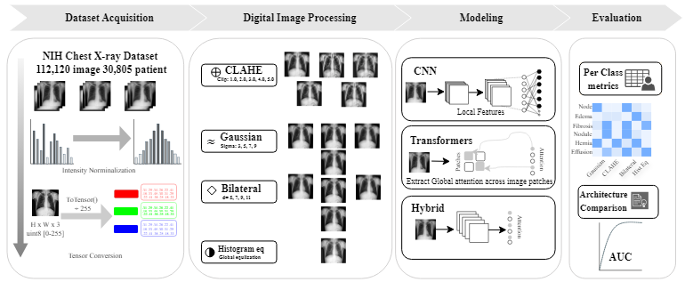

# Official implementation of the study: "Model-Dependent and Class-Specific Effects of Digital Image Processing on Multi-Label Chest X-ray Classification"

> **Does image preprocessing actually help? It depends on your model.**
> A controlled large-scale study of Digital Image Processing (DIP) techniques across CNN, Transformer, and Hybrid deep learning architectures on the NIH ChestX-ray14 dataset.

---

## Overview

Standard preprocessing is often treated as a neutral, fixed step in medical imaging pipelines. This work challenges that assumption.

We present a **systematic, controlled evaluation** of 15 preprocessing configurations across 5 deep learning architectures, revealing that preprocessing effectiveness is **strongly architecture-dependent** and **pathology-dependent** — not universally beneficial.

---

## Experimental Pipeline
<p align="center">
  
  <br>
  <em>Fig 1. Overview of the experimental framework used in this study. The NIH ChestXray14 dataset was first partitioned using patient-wise splitting and standardized preprocessing. Baseline DL models were trained without DIP techniques, followed by controlled DIP-based experiments across multiple filter configurations. Final evaluation included per-class analysis, architecture comparison, and preprocessing sensitivity assessment.</em>
</p>


---

## Findings

- **CNN-based models** (ResNet-50, DenseNet-121) frequently achieved optimal performance under **baseline conditions** — excessive preprocessing degraded performance by disrupting local texture features.
- **Transformer and hybrid models** (ViT-B16, Swin-Tiny, ConvFormer) **benefited from contrast enhancement** (CLAHE, Histogram Equalization), likely due to their reliance on global contextual relationships.
- **No single preprocessing configuration** consistently improves performance across all 14 thoracic pathologies.
- Aggressive smoothing (large Gaussian kernels, high bilateral filter parameters) consistently **degraded performance** across most architectures.

---

## Repository Structure

The repository is organized by architecture. Each model family contains:

* Baseline training and evaluation scripts
* DIP-based ablation experiments
* Test result summaries
* Architecture-specific preprocessing sensitivity analyses

```text
.
├── ConvFormer_Main/
│   ├── ConvFormer/
│   │   ├── train.py
│   │   └── test.py
│   ├── ConvFormer DIP/
│   │   ├── ablation_study.py
│   │   ├── test_ablation_models.py
│   │   └── test_results/
│   ├── ConvFormer_Heatmap.png
│   └── Heatmap.py
│
├── DenseNet_Main/
│   ├── DenseNet/
│   ├── DenseNet DIP/
│   ├── DenseNet_Heatmap.png
│   └── Heatmap.py
│
├── ResNet50_Main/
│   ├── ResNet50/
│   ├── ResNet50_DIP/
│   ├── ResNet50_Heatmap.png
│   └── Heatmap.py
│
├── ResNet101_Main/
│   ├── ResNet101/
│   ├── ResNet101 DIP/
│   ├── ResNet101_Heatmap.png
│   └── Heatmap.py
│
├── ViT_b16_Main/
│   ├── ViT_b16/
│   ├── ViT_b16 DIP/
│   ├── ViT-b16_Heatmap.png
│   └── Heatmap.py
│
├── swin_t_Main/
│   ├── swin_t/
│   ├── swin_t DIP/
│   ├── Swin-T_Heatmap.png
│   └── Heatmap.py
│
├── filter_examples/
│   ├── baseline.png
│   ├── clahe_*.png
│   ├── gaussian_*.png
│   ├── bilateral_*.png
│   └── hist_eq.png
│
├── gather_results.py
├── requirements.txt
└── README.md
```

Heatmaps and filter examples are included to facilitate interpretation of preprocessing effects across architectures and pathologies.


---

## ⚙️ Preprocessing Configurations

All 15 configurations were evaluated under **identical training conditions** (same optimizer, learning rate, data split, and augmentation) for fair comparison.

| # | Filter | Parameters |
|---|--------|------------|
| 1 | Baseline | No DIP applied |
| 2–6 | CLAHE | Clip limits: 1.0, 2.0, 3.0, 4.0, 5.0 |
| 7–10 | Gaussian Blur | Kernel sizes: 3, 5, 7, 9 |
| 11–14 | Bilateral Filter | Diameters: 5, 7, 9, 11 |
| 15 | Histogram Equalization | Global |

---

## Architectures

| Model | Type | Backbone |
|-------|------|----------|
| ResNet-50 | CNN | Residual connections |
| DenseNet-121 | CNN | Dense connections |
| ViT-B16 | Transformer | Patch-based self-attention |
| Swin-Tiny | Transformer | Shifted window attention |
| ConvFormer | Hybrid | Conv + attention |

All models use **ImageNet pre-trained weights** with a multi-label sigmoid output head (14 classes).

---

## Dataset

This repository does **not** distribute the NIH ChestX-ray14 dataset.

The dataset can be obtained from:

* NIH ChestX-ray14
* Kaggle resized version used in this study

The experiments expect the following files:

```text
dataset/
├── Data_Entry_2017.csv
├── train_val_list_NIH.txt
└── images-224/
    ├── 00000001_000.png
    ├── 00000002_000.png
    └── ...
```

Before running any experiment, update the dataset paths in the corresponding training and testing scripts if your local directory structure differs.

Dataset statistics:

| Property | Value                      |
| -------- | -------------------------- |
| Images   | 112,120                    |
| Patients | 30,805                     |
| Labels   | 14 thoracic diseases       |
| Task     | Multi-label classification |
| Split    | Patient-wise               |

Pathologies include Atelectasis, Cardiomegaly, Effusion, Infiltration, Mass, Nodule, Pneumonia, Pneumothorax, Consolidation, Edema, Emphysema, Fibrosis, Pleural Thickening, and Hernia.

---

## Getting Started

### Installation

Create a Python environment and install dependencies:

```bash
pip install -r requirements.txt
```

### Running Baseline Experiments

Examples:

```bash
# DenseNet-121 baseline
python DenseNet_Main/DenseNet/train.py

# ResNet-50 baseline
python ResNet50_Main/ResNet50/train.py

# ViT-B16 baseline
python ViT_b16_Main/ViT_b16/train.py

# Swin-Tiny baseline
python swin_t_Main/swin_t/train.py

# ConvFormer baseline
python ConvFormer_Main/ConvFormer/train.py
```

### Running DIP Ablation Studies

Examples:

```bash
# DenseNet-121 DIP study
python DenseNet_Main/DenseNet DIP/train_densenet_ablation.py

# ResNet-50 DIP study
python ResNet50_Main/ResNet50_DIP/train_resnet50_ablation.py

# ViT-B16 DIP study
python ViT_b16_Main/ViT_b16 DIP/train_vit_ablation.py

# Swin-Tiny DIP study
python swin_t_Main/swin_t DIP/train_swin_ablation.py

# ConvFormer DIP study
python ConvFormer_Main/ConvFormer DIP/ablation_study.py
```

### Included Results

To reduce repository size, trained model checkpoints are not distributed.

The repository includes:

* Architecture-specific preprocessing sensitivity heatmaps
* Representative filter outputs
* Summary result tables
* Aggregated evaluation results used for analysis in the paper

These files are sufficient to reproduce the reported trends and visualize preprocessing effects across architectures.

---

## Training Details

| Setting | Value |
|---------|-------|
| Image size | 224 × 224 |
| Batch size | 128 |
| Optimizer | Adam (lr = 1e-4) |
| LR scheduler | ReduceLROnPlateau (factor=0.5, patience=2) |
| Loss function | BCEWithLogitsLoss |
| Early stopping | Patience = 10 (val loss) |
| Max epochs | 100 |
| Mixed precision | AMP (float16) |
| Metric | AUC-ROC (per-class + mean) |

**Augmentation (train only):** Random horizontal flip, ±10° rotation, brightness/contrast jitter (0.1).

---

## Evaluation

Performance is measured using **AUC-ROC** per pathology class and mean AUC across all 14 classes. Results are visualized as:

- Per-architecture mean AUC tables across all 15 configs
- Per-disease × per-config heatmaps showing preprocessing sensitivity

---
## License

This project is licensed under the MIT License. See `LICENSE` for details.

---

## Acknowledgements

- NIH Clinical Center for the ChestX-ray14 dataset
- PyTorch and torchvision teams
- OpenCV for DIP filter implementations
